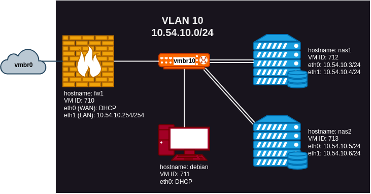

# TrueNAS Lab
This Proxmox Terraform lab downloads the installation media for TrueNAS SCALE Dragonfish, VyOS, and Debian.  I then creates four virtual machines, connects them to an isolated switch (`vmbr10` in the example files), and inserts the installation media into the appropriate virtual machines so that you can install the operating systems.  This lab has two virtual machines (cores, 8GB RAM, two network cards, seven 20GB disks) for running TrueNAS SCALE, a VyOS firewall (2 cores, 1GB RAM, two network cards, one 20GB disk) to act as NAT gateway to the Internet and provide DNS/DHCP on the switch's subnet, and a Debian workstation (4 cores, 8GB RAM, one network card, one 20GB disk) for testing access to NAS shares.  Note, this Terraform project only downloads the media and creates the virtual machines.  It does not use Ansible to install the operating systems so you will have to do that yourself.



## Make Copies of the Example Files
Site specific configuration is stored in variables within `*.auto.tfvars` files.  Example configuration files with a `.example` extension are included.  Make a copy of each of these files with the same filename, but without the `.example` extension and edit values as appropriate to your site.  At a minimum, you will need to change `endpoint` and `api_token` the in `terraform.tfvars`.

```shell
cp network.auto.tfvars.example network.auto.tfvars &&
cp terraform.tfvars.example terraform.tfvars &&
cp vms.auto.tfvars.example vms.auto.tfvars &&
terraform init &&
vim terraform.tfvars
```

Depending on the changes you make, you may also have to change the configuration of the VyOS firewall (e.g. if you change a virtual machine's MAC address, you will have to change the configuration for the static DHCP address reservation, etc.).

> [!TIP]
> For help configuring VyOS, see the "Configuration and Operation" section of the [VyOS User Guide](https://docs.vyos.io/en/latest/index.html).

```shell
cp vyos.conf.example vyos.conf
vim vyos.conf
```

## Download the installation media
The downloading of the installation ISO files is handled in a separate Terraform project in the `installation_media` directory.  This is allows you to download the installation media to your Proxmox ISO storage once and still use Terraform to repeated create and destroy the virtual machines as often as you like.  This saves time and bandwidth.

> [!NOTE]
> The installation_media directory also has example files you will need to rename and possibly edit.

> [!TIP]
> The contents of the terraform.tfvars file in the installation_media directory is the same as the one in the parent directory so we can just copy that.

```shell
cd installation_media &&
cp media.auto.tfvars.example media.auto.tfvars &&
cp ../terraform.tfvars terraform.tfvars &&
terraform init &&
terraform apply -auto-approve
cd ..
```

## Create the virtual machines
Once the variable files exist and the installation media has been downloaded, you can create the virtual machines.

```shell
terraform init
```

# OS Installation
## Install and configure the VyOS firewall first
Install and configure VyOS first so that the other machines will have DNS/DHCP services and access to the network from the isolated switch.  Technically, you could install TrueNAS SCALE without first setting up VyOS, but TrueNAS tries to configure networking via DHCP on initial install so it is nice to have this setup first.  The Debian installation media is the netinst ISO and requires access to the Internet for installation.

When the vyos virtual machine boots, it is running from the ISO installation media.  Login with username "vyos" and password "vyos" and run this command to install to the virtual machine's hard drive:

```shell
install image
```

Follow the setup prompts and reboot.  The virtual machine is configured to try booting from the hard drive before booting from the CD-ROM so it should boot from the hard drive now.  Now you need to configure the virtual machine to be a NAT gateway and DNS/DHCP server.  The vyos.config.example file is provided as an example that should only need minor edits.

> [!TIP]
> The firewall has a serial port so you can connect the console to that in Proxmox using the `xterm.js` console.  This is handy since you can paste the configuration into a serial terminal.

> [!TIP]
> You can use `sed` to make minor edits to the example config before dumping it to the screen to be cut and paste into the terminal.  For example, to change the DNS domain name, do something like this:
> ```shell
> sed 's/example.com/mydomain.org/g' vyos.config
> ```

## Install the Debian workstation virtual machine
The Debian workstation virtual machine provides a means for accessing the TrueNAS web interface and for testing access to NAS shares.  The VyOS firewall must be installed and configured before installing the Debian workstation.  Other than that requirement, there is nothing special about the Debian installation.

## Install and configure TrueNAS SCALE
Before installing TrueNAS SCALE, you will want to add unique serial numbers to the hard drives in the virtual machines.  Run the following from the root shell on the Proxmox node to add a unique serial number to each hard drive in the virtual machines before installing TrueNAS SCALE.  If you don't do this, TrueNAS will complain about non-unique serial numbers when you go to create a pool.  Note, if you changed the virtual machine ID numbers in the example files, make sure you update the ID numbers in the following commands be fore running them.

```shell
sed -i -r '/^virtio.*serial=.*/!s/^virtio([0-9]+):(.*)/virtio\1:\2,serial=\1/' /etc/pve/qemu-server/712.conf
sed -i -r '/^virtio.*serial=.*/!s/^virtio([0-9]+):(.*)/virtio\1:\2,serial=\1/' /etc/pve/qemu-server/713.conf
```

After adding serial numbers to hard drives, proceed with the TrueNAS SCALE installation.  You can use the CLI to configure TrueNAS SCALE from the console or use the Debian workstation virtual machine to access the TrueNAS SCALE web interface.

Two virtual machines are provided for TrueNAS scale for testing replication.
